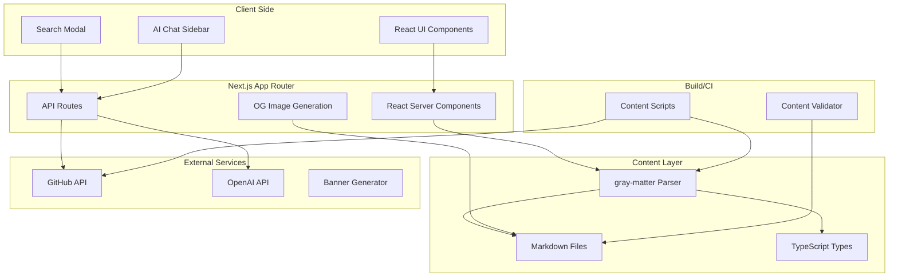

# Gitcoin CO 30 Analysis

## Executive Summary

Gitcoin CO 30 is a Next.js-based content directory and reference library for Ethereum public goods funding. It serves as a curated knowledge base covering funding mechanisms, apps/platforms, case studies, research, and campaigns in the web3 ecosystem. The architecture demonstrates a sophisticated pattern for building content-driven websites with GitHub-integrated editorial workflows.

---

## 1. STRUCTURE ANALYSIS

### 1.1 Directory Organization

```
gitcoin_co_30/
├── src/
│   ├── app/                    # Next.js App Router (RSC-based)
│   │   ├── api/               # API routes (chat, preview, search)
│   │   ├── [content-type]/    # Dynamic content routes
│   │   ├── page.tsx           # Homepage
│   │   ├── layout.tsx         # Root layout with providers
│   │   └── globals.css        # Global styles
│   ├── components/
│   │   ├── cards/             # Content cards (AppCard, CaseStudyCard, etc.)
│   │   ├── layouts/           # Page layout components
│   │   ├── search/            # Search UI (modal, sidebar)
│   │   ├── ui/                # Base UI components
│   │   └── ai-elements/       # AI chat components
│   ├── content/               # Content source of truth
│   │   ├── apps/              # 35+ app markdown files
│   │   ├── mechanisms/        # 100+ mechanism markdown files
│   │   ├── case-studies/      # 60+ case study markdown files
│   │   ├── research/          # 60+ research markdown files
│   │   ├── campaigns/         # 10+ campaign markdown files
│   │   └── *.ts               # Content loading modules
│   └── lib/                   # Shared utilities
│       ├── types.ts           # TypeScript definitions
│       ├── markdown.ts        # Markdown parsing (gray-matter)
│       ├── metadata.ts        # SEO metadata generation
│       ├── page-seo.ts        # Page-level SEO config
│       ├── og-image.tsx       # OpenGraph image generation
│       ├── json-ld.ts         # Structured data (Schema.org)
│       ├── parse-issue.ts     # GitHub issue parsing
│       └── utils.ts           # Utility functions
├── scripts/                   # Content management scripts
│   ├── publish-content.ts     # Generic content publisher
│   ├── validate-issue.ts      # Issue validation
│   ├── validate-content.ts    # Content validation
│   ├── shared-utils.ts        # Script utilities
│   └── *.ts                   # Type-specific publishers
├── public/
│   └── content-images/        # Downloaded/optimized images
├── tsconfig.json              # TypeScript configuration
└── package.json               # Dependencies (not present in export)
```

### 1.2 Build System & Dependencies

**Framework:** Next.js 14+ with App Router

**Core Dependencies (inferred from code):**
- `next` - React framework with RSC support
- `react` / `react-dom` - UI library
- `typescript` - Type safety
- `tailwindcss` - Utility-first CSS
- `gray-matter` - Frontmatter parsing
- `react-markdown` - Markdown rendering
- `remark-gfm` / `remark-breaks` - Markdown plugins
- `@ai-sdk/react` / `@ai-sdk/openai` - AI chat
- `ai` - Vercel AI SDK
- `sharp` - Image processing
- `clsx` / `tailwind-merge` - Class merging
- `@radix-ui/react-dialog` - Accessible UI primitives
- `lucide-react` - Icon library
- `@next/third-parties/google` - Google Analytics

### 1.3 File Organization Patterns

| Category | Location | Purpose |
|----------|----------|---------|
| **Routes** | `src/app/**` | Next.js App Router pages |
| **Content** | `src/content/**` | Markdown files with YAML frontmatter |
| **Content APIs** | `src/content/*.ts` | Type-safe content loaders |
| **UI Components** | `src/components/**` | Reusable React components |
| **Utilities** | `src/lib/**` | Business logic & helpers |
| **Scripts** | `scripts/**` | CLI content management tools |
| **Static Assets** | `public/**` | Images, fonts, OG images |

---

## 2. FEATURE EXTRACTION

### 2.1 Core Features Matrix

| Feature | Description | Complexity | External Dependencies |
|---------|-------------|------------|----------------------|
| **Content Directory** | 5 content types (apps, mechanisms, case-studies, research, campaigns) | Medium | gray-matter, fs |
| **Markdown Rendering** | Custom-styled ReactMarkdown with GFM | Low | react-markdown, remark-* |
| **Related Content** | Bidirectional linking between content items | Medium | Custom relation logic |
| **Search API** | Server-side fuzzy search across all content | Low | Native Next.js API |
| **AI Chat** | RAG-based assistant with vector store | High | OpenAI, Vercel AI SDK |
| **OG Image Generation** | Dynamic OpenGraph images per content item | Medium | next/og (Satori) |
| **Image Processing** | Download, optimize, convert images | Medium | sharp |
| **GitHub Integration** | Issue-to-content workflow | High | GitHub API |
| **Content Validation** | Multi-stage validation (issue → markdown) | Medium | Custom validators |
| **SEO/Structured Data** | JSON-LD, sitemap, meta tags | Low | next/metadata |
| **Banner Generator** | External tool integration | Low | Fetch proxy |
| **Preview API** | PR/issue preview before merge | High | GitHub API + parsing |

### 2.2 Feature Complexity Assessment

#### 🔴 High Complexity (3 features)
1. **AI Chat with RAG** (`/api/chat/route.ts`)
   - OpenAI vector store integration
   - Streaming responses
   - Context-aware prompting
   - Scope limitation rules

2. **GitHub Content Pipeline** (`scripts/` + `/api/preview/`)
   - Issue parsing (2 formats: forms + legacy)
   - Image downloading & processing
   - PR preview functionality
   - Content validation at multiple stages

3. **Dynamic OG Images** (`src/lib/og-image.tsx`)
   - Satori-based JSX-to-image
   - Custom font loading
   - Banner overlay logic
   - Fallback templates

#### 🟡 Medium Complexity (5 features)
4. **Content Relations** - Cross-linking 5 content types
5. **Image Pipeline** - Download, SVG→PNG conversion, optimization
6. **Search Modal** - Radix UI dialog with debounced search
7. **Content Validation** - Multi-stage validation rules
8. **Type-Safe Content** - TypeScript integration with markdown

#### 🟢 Low Complexity (4 features)
9. **Markdown Rendering** - Styled ReactMarkdown
10. **SEO/Sitemap** - Static + dynamic metadata
11. **Layout System** - Reusable page layouts
12. **UI Components** - Tailwind-based component library

### 2.3 External API Dependencies

| API | Purpose | Integration Point |
|-----|---------|-------------------|
| **GitHub API** | Content submission, PR preview | `scripts/`, `/api/preview/` |
| **OpenAI API** | Chat completions, vector search | `/api/chat/` |
| **Raw GitHub** | PR branch content loading | `/api/preview/` |
| **External Banner Gen** | Visual asset generation | `/generator/` proxy |

---

## 3. INTEGRATION POINTS

### 3.1 System Architecture Diagram



### 3.2 Agent Interaction Patterns

The project includes several AI/agent integration patterns:

1. **RAG-Based Chat** (`/api/chat/route.ts`)
   - Vector store search for context retrieval
   - Streaming responses with UI message components
   - Prompt engineering for scope limitation
   - Citation links to content pages

2. **Content Preview Bot** (`/api/preview/route.ts`)
   - GitHub issue/PR parsing
   - Renders preview before content merge
   - Image resolution from raw.githubusercontent.com

3. **Validation Scripts** (`scripts/validate-*.ts`)
   - Pre-commit validation
   - Issue format compliance
   - Content quality checks

### 3.3 Exposed APIs & Protocols

| Endpoint | Method | Purpose |
|----------|--------|---------|
| `/api/chat` | POST | AI assistant with streaming |
| `/api/search?q=` | GET | Content search API |
| `/api/preview?issue=` | GET | GitHub issue preview |
| `/api/preview?pr=` | GET | PR content preview |
| `/generator/` | GET | Banner generator proxy |

### 3.4 Content Types & Relationships

```
┌─────────────┐     ┌─────────────┐     ┌─────────────┐
│    Apps     │◄───►│ Mechanisms  │◄───►│ Case Studies│
└──────┬──────┘     └──────┬──────┘     └──────┬──────┘
       │                   │                   │
       │            ┌────────▼────────┐       │
       └───────────►│     Research    │◄──────┘
                    └────────┬────────┘
                             │
                    ┌────────▼────────┐
                    │    Campaigns    │
                    └─────────────────┘
```

All content types share `BaseContent` interface with cross-references via `related*` arrays.

---

## 4. ADAPTABILITY ASSESSMENT

### 4.1 Context-Agnostic Features (Highly Reusable)

| Feature | Reusability | Adaptation Effort | Notes |
|---------|-------------|-------------------|-------|
| **Markdown Content System** | ⭐⭐⭐⭐⭐ | 2-4 hours | Generic gray-matter + ReactMarkdown setup |
| **Type-Safe Content Loader** | ⭐⭐⭐⭐⭐ | 1-2 hours | Pattern applicable to any markdown content |
| **OG Image Generator** | ⭐⭐⭐⭐⭐ | 2-3 hours | JSX-to-image with custom templates |
| **Search Modal** | ⭐⭐⭐⭐⭐ | 2-3 hours | Radix UI + debounced fetch pattern |
| **SEO/Metadata System** | ⭐⭐⭐⭐⭐ | 1-2 hours | Next.js metadata API wrapper |
| **Content Relations** | ⭐⭐⭐⭐ | 3-5 hours | Bidirectional linking pattern |
| **Image Processing** | ⭐⭐⭐⭐⭐ | 1-2 hours | Download + sharp optimization |
| **Sitemap Generation** | ⭐⭐⭐⭐⭐ | <1 hour | Standard Next.js pattern |
| **JSON-LD Structured Data** | ⭐⭐⭐⭐⭐ | 1-2 hours | Schema.org helpers |
| **UI Component Library** | ⭐⭐⭐⭐ | 3-6 hours | Tailwind-based, design-token dependent |

### 4.2 Gitcoin-Specific Features (Lower Reusability)

| Feature | Coupling | Adaptation Effort | Notes |
|---------|----------|-------------------|-------|
| **GitHub Issue Workflow** | ⭐⭐⭐⭐⭐ | 8-16 hours | Hardcoded repo, issue templates, parsing |
| **AI Chat Scope Guard** | ⭐⭐⭐⭐ | 4-8 hours | Domain-specific prompt engineering |
| **OpenAI Vector Store** | ⭐⭐⭐⭐ | 4-6 hours | Specific to OpenAI implementation |
| **Content Type Definitions** | ⭐⭐⭐ | 4-6 hours | App/Mechanism/CaseStudy semantics |
| **Gitcoin Branding** | ⭐⭐⭐⭐⭐ | 4-8 hours | Colors, fonts, logo in OG images |
| **Banner Generator Proxy** | ⭐⭐⭐⭐ | 2-4 hours | Specific to external tool |
| **Sensemaking Articles** | ⭐⭐⭐⭐ | 2-4 hours | Gitcoin-specific content taxonomy |

### 4.3 Effort Estimates for Adaptation

#### Quick Win Features (2-6 hours each)
- ✅ Markdown rendering pipeline
- ✅ Type-safe content loading
- ✅ OG image generation framework
- ✅ Search UI components
- ✅ SEO metadata system
- ✅ Image optimization pipeline

#### Medium Effort (8-16 hours each)
- 🔧 Content validation system (adapt rules)
- 🔧 GitHub integration (repo, templates, auth)
- 🔧 AI chat integration (new vector store, prompts)
- 🔧 Related content linking (new content types)

#### Higher Effort (20-40 hours each)
- 🔴 Full editorial workflow migration
- 🔴 Custom content types with relations
- 🔴 Complete design system replacement
- 🔴 AI assistant retraining for new domain

---

## 5. ARCHITECTURE RECOMMENDATIONS

### 5.1 For ReFi Toolkit Adaptation

1. **Extract Generic Core** (20-30 hours)
   - Isolate `src/lib/markdown.ts`, `src/lib/types.ts` patterns
   - Extract OG image generator with configurable templates
   - Generalize search API to any content type

2. **Adapt Content Model** (15-25 hours)
   - Replace Gitcoin content types with ReFi-specific types
   - Example: `Projects`, `Frameworks`, `Methodologies`, `Reports`
   - Keep the `BaseContent` + `related*` pattern

3. **Modify Editorial Workflow** (10-20 hours)
   - Fork `publish-content.ts` for new content types
   - Update `validate-issue.ts` rules
   - Configure new GitHub issue templates

4. **Brand/Design Adaptation** (15-30 hours)
   - Replace Gitcoin colors/fonts in Tailwind config
   - Create new OG image templates
   - Update header/footer components

### 5.2 Reusable Module Candidates

```typescript
// Candidate for shared library: @regen-toolkit/content
export interface ContentSystemConfig {
  contentTypes: ContentType[];
  basePath: string;
  imageProcessor?: ImageProcessorConfig;
  validationRules?: ValidationRule[];
}

export function createContentSystem(config: ContentSystemConfig) {
  // Returns: loaders, validators, API handlers
}
```

---

## 6. TECHNICAL DEBT & OBSERVATIONS

### 6.1 Strengths
- ✅ Clean separation of concerns (content, UI, scripts)
- ✅ TypeScript throughout with strong typing
- ✅ RSC-first architecture for performance
- ✅ Modular component design
- ✅ Comprehensive SEO/structured data
- ✅ Editorial workflow integration

### 6.2 Potential Improvements
- ⚠️ No package.json in export (dependency inference required)
- ⚠️ Hardcoded GitHub repo in multiple files
- ⚠️ Content validation scattered across files
- ⚠️ No clear plugin/extension mechanism
- ⚠️ AI prompts hardcoded (should be configurable)

### 6.3 Security Considerations
- ✅ Image download host allowlist (`ALLOWED_HOSTS`)
- ✅ GitHub token for API auth
- ✅ No direct DB connections (file-based content)
- ⚠️ OpenAI API key exposure (should be server-only)

---

## Appendix: Content Statistics

| Content Type | Count | Location |
|--------------|-------|----------|
| Apps | 35 | `src/content/apps/` |
| Mechanisms | 100+ | `src/content/mechanisms/` |
| Case Studies | 60+ | `src/content/case-studies/` |
| Research | 60+ | `src/content/research/` |
| Campaigns | 10+ | `src/content/campaigns/` |
| **Total** | **260+** | **Markdown files** |

---

*Analysis completed: 2026-03-28*
*Analyst: OpenClaw Subagent*
*Source: `/root/Zettelkasten/03 Libraries/gitcoin_co_30/`*
