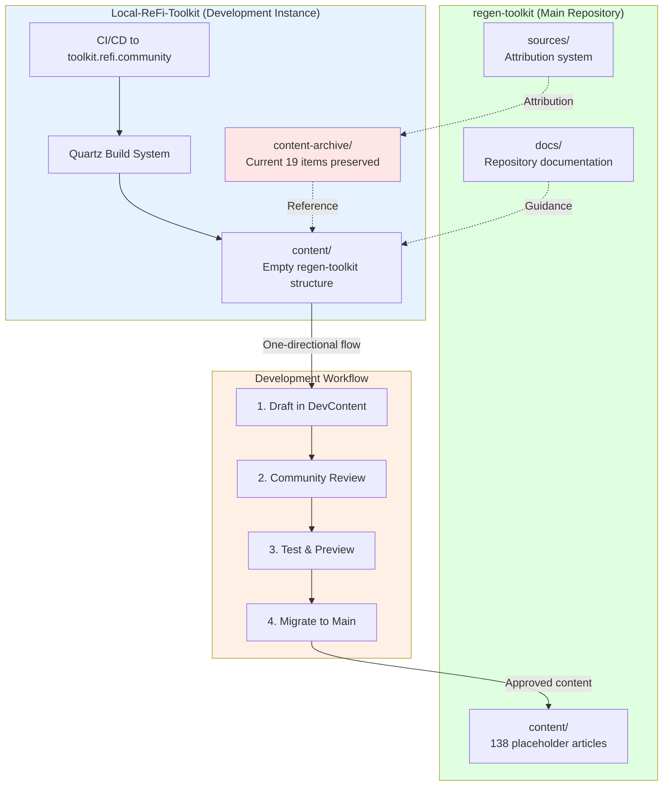

# Local ReFi Toolkit Development Workflow

## Repository Relationships

### Main Repository: regen-toolkit
- **Purpose**: Stable, published content library
- **Repository**: [github.com/explorience/regen-toolkit](https://github.com/explorience/regen-toolkit)
- **Content**: 138 structured placeholder articles across 3 tracks (Foundations, Applied, Playbooks)
- **Status**: Educational resource and knowledge base
- **Build System**: Not yet configured (content-only repository)

### Development Instance: Local-ReFi-Toolkit
- **Purpose**: ReFi DAO-led development, testing, and community collaboration
- **Repository**: [github.com/ReFiDAO/local-refi-toolkit](https://github.com/ReFiDAO/local-refi-toolkit)
- **Live Site**: [toolkit.refi.community](https://toolkit.refi.community)
- **Content**: 19 published content items (16 published + 3 drafts)
- **Status**: Active development environment
- **Build System**: Quartz static site generator (v4.4.0) with CI/CD deployment

## Dual-Container Architecture

The Local-ReFi-Toolkit repository uses a **dual-container architecture** to separate historical content from active development:

### Container 1: content-archive/
**Purpose**: Preserve all existing Local-ReFi-Toolkit content (19 published items) as-is

- **Location**: `Local-ReFi-Toolkit/content-archive/`
- **Content**: All original case studies, playbooks, frameworks, planning documents
- **Structure**: Maintains original organization (00-getting-started/, 01-playbooks/, 02-case-studies/, etc.)
- **Status**: Historical reference and source for future migrations
- **Access**: Available via GitHub repository

### Container 2: content/
**Purpose**: Active development container mirroring regen-toolkit structure

- **Location**: `Local-ReFi-Toolkit/content/`
- **Structure**: Mirrors `regen-toolkit/content/` exactly:
  - `1-foundations/` (10 sections)
  - `2-applied/` (14 sections)
  - `3-playbooks/` (6 sections)
- **Status**: Empty placeholders ready for development
- **Build**: Quartz builds from this directory for development site

## Content Flow Architecture



**Key Flow Characteristics:**
- **One-directional**: Content flows from Local-ReFi-Toolkit → regen-toolkit (initially)
- **Dual containers**: Archive preserves history, content/ enables development
- **Structure alignment**: content/ mirrors regen-toolkit structure exactly
- **Clear separation**: Development (Local-ReFi-Toolkit) vs. Stable (regen-toolkit)

## Development Workflow

### For Content Contributors

1. **Fork Local-ReFi-Toolkit** repository
2. **Create content** in `content/` directory following regen-toolkit structure
   - Place drafts in appropriate track/section
   - Follow existing placeholder structure
   - Use consistent frontmatter format
3. **Submit PR** to Local-ReFi-Toolkit
4. **Community review** process (ReFi DAO coordination)
5. **Test & Preview** on development site (toolkit.refi.community)
6. **Migration** to regen-toolkit via PR when content is approved

### For Content Consumers

- **Read stable content**: Use regen-toolkit (main repository)
- **Preview upcoming content**: Use Local-ReFi-Toolkit development site
- **Provide feedback**: Submit issues to Local-ReFi-Toolkit repository
- **Access archive**: View historical content in content-archive/ section

## Content Mapping Strategy

The following mapping documents how content from Local-ReFi-Toolkit's archive will be migrated to regen-toolkit:

### Case Studies (6 items)
**Source**: `content-archive/02-case-studies/by-region/`
- ReFi-Lagos-Plastic-Waste-Management.md
- ReFi-Costa-Rica-Crypto-Philanthropy.md
- ReFi-Barcelona-Cooperative-Structure.md
- ReFi-Tanzania-Community-Verification.md
- ReFi-Mexico-Impact-Market-Maker.md
- ReFi-Sicilia-Reforestation-Initiative.md

**Target**: `regen-toolkit/content/3-playbooks/3.3-case-studies-region/`

### Protocol-Specific Playbooks (4 items)
**Source**: `content-archive/01-playbooks/protocol-specific/`
- Forest-Monitoring-Verification-Implementation.md
- Quadratic-Funding-Implementation.md
- Carbon-Credit-Development-Implementation.md
- Community-Verification-Systems-Implementation.md

**Target**: `regen-toolkit/content/3-playbooks/3.1-protocol-playbooks/`

### Quick-Start Guides (3 items)
**Source**: `content-archive/01-playbooks/quick-start/`
- Community-ReFi-Assessment.md
- Basic-Impact-Tracking.md
- Starting-Local-ReFi-Group.md

**Target**: `regen-toolkit/content/2-applied/2.1-local-nodes/` (or new subsection)

### Frameworks (2 items)
**Source**: `content-archive/03-frameworks/`
- Cooperative-Web3-Governance-Framework.md
- Community-Driven-Impact-Verification-Framework.md

**Target**: `regen-toolkit/content/3-playbooks/3.2-implementation-patterns/`

### Educational Foundation (1 item)
**Source**: `content-archive/00-getting-started/`
- Understanding-Regenerative-Finance.md

**Target**: `regen-toolkit/content/1-foundations/1.9-refi-landscape/`

### Draft Content (3 items)
**Source**: `content-archive/01-playbooks/drafts/` (or quick-start/)
- Host-Intro-To-ReFi-Meetup-NOTION.md
- DeCleanup-Environmental-Cleanup-NOTION.md
- ReFi-Lisboa-Local-Node-Journey-NOTION.md

**Target**: To be determined after completion/review

### Planning Documents (10 items)
**Source**: `content-archive/07-planning/`
- Strategic planning documents preserved for historical reference
- May inform future content development but not directly migrated

## Migration Protocol

### Content Migration Checklist

Before migrating content from Local-ReFi-Toolkit to regen-toolkit:

- [ ] Content reviewed by ReFi DAO community
- [ ] All internal links updated for regen-toolkit structure
- [ ] Metadata transformed (frontmatter) with proper source attribution
- [ ] Images and assets copied to regen-toolkit
- [ ] Source attribution added (`source_code: "A"`)
- [ ] Cross-references validated
- [ ] Content aligns with regen-toolkit's 3-track structure
- [ ] Target section identified and verified

### Frontmatter Transformation

**Original Local-ReFi-Toolkit format**:
```yaml
---
title: "Article Title"
tags: #tags
draft: false
---
```

**Transformed for regen-toolkit**:
```yaml
---
title: "Article Title"
section: "X.Y"           # Section number (e.g., "3.1", "2.3")
track: [1|2|3]           # Track number
status: published        # Content status
author: null             # Author (if known)
sources:                 # Source references
  - code: "A"
source_code: "A"
source_url: "https://github.com/ReFiDAO/local-refi-toolkit"
migrated_from: "local-refi-toolkit/content-archive/..."
migration_date: "YYYY-MM-DD"
audience: [grounded-regen|curious-degen|onchain-regen]
estimated_words: 800
created: YYYY-MM-DD
---
```

## Cross-Repository Linking

### Referencing Main Repo from Development

**Link format**:
```markdown
[Article Name](https://github.com/explorience/regen-toolkit/blob/main/content/...)
```

**Best practices**:
- Use relative paths for local development
- Use absolute URLs for published references
- Link to specific files, not just directories
- Include section/track context in link text

**Example**:
```markdown
> **Related Content**: This article builds on [Blockchain Fundamentals](https://github.com/explorience/regen-toolkit/blob/main/content/1-foundations/1.3-blockchain-fundamentals/what-is-blockchain.md) in the Regen Toolkit.
```

### Referencing Development from Main

**Source attribution**:
- All content from Local-ReFi-Toolkit includes `source_code: "A"` in frontmatter
- Reference development site: [toolkit.refi.community](https://toolkit.refi.community)
- Link to specific development features or preview content

**Example**:
```markdown
> **Source**: This content was developed by ReFi DAO through the [Local ReFi Toolkit](https://github.com/ReFiDAO/local-refi-toolkit) development instance. See the [live case studies](https://toolkit.refi.community/case-studies/) for latest updates.
```

## Version Control & Synchronization

### Git Workflow

- **Main repo**: explorience/regen-toolkit (stable releases)
- **Dev repo**: ReFiDAO/local-refi-toolkit (active development)
- **No git submodules**: Independent repositories
- **Periodic content sync**: Via migration scripts and PRs

### Branching Strategy

**regen-toolkit**:
- `main`: Stable content only
- `content-updates`: Batch migrations from dev instance
- `hotfixes`: Emergency corrections

**Local-ReFi-Toolkit**:
- `main`: Development site deployment
- `feature/*`: New content development
- `review/*`: Content under community review

### Synchronization Schedule

- **Weekly**: Review ready-to-publish content in dev instance
- **Bi-weekly**: Migration batch from dev to main
- **Monthly**: Sync corrections/updates from main back to dev (if needed)

## Source Attribution System

### Existing Source A Reference

The regen-toolkit already lists "ReFi DAO Local ReFi Toolkit" as Source A in:
- `content/sources/a-refi-dao-toolkit.md`
- README.md source references table

All migrated content includes `source_code: "A"` in frontmatter.

## Maintenance & Updates

### Regular Synchronization

- **Weekly**: Review ready-to-publish content in dev instance
- **Bi-weekly**: Migration batch from dev to main
- **Monthly**: Sync corrections/updates from main back to dev

### Documentation Updates

- **This document**: Update when workflow changes
- **Local-ReFi-Toolkit docs**: Update for development process
- **Community announcements**: For major changes

## Contact & Support

### ReFi DAO Content Team

- **Development instance**: coordination@refi.community
- **Repository**: [github.com/ReFiDAO/local-refi-toolkit](https://github.com/ReFiDAO/local-refi-toolkit)
- **Live site**: [toolkit.refi.community](https://toolkit.refi.community)

### Main Repository Maintainers

- **Repository**: [github.com/explorience/regen-toolkit](https://github.com/explorience/regen-toolkit)
- **Issues**: Use GitHub issue tracker
- **Contributions**: See CONTRIBUTING.md

## Related Documentation

- [Source Attribution: ReFi DAO Local ReFi Toolkit](../content/sources/a-refi-dao-toolkit.md)
- [Contributing Guidelines](../CONTRIBUTING.md)
- [Main README](../README.md)

---

**Last Updated**: 2026-01-28  
**Maintained by**: ReFi DAO Coordination Team  
**Status**: Active Development
